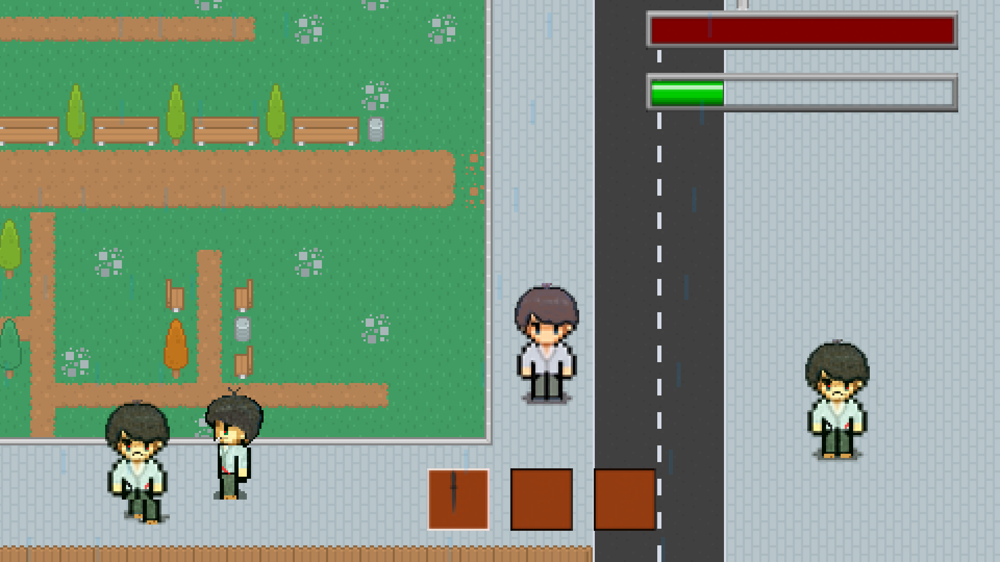

# MyRPG

### Introduction

Le MyRPG est notre dernier projet graphique de l'année. Le but est de créer un jeu type RPG comme Final Fantasy par exemple.

### Fonctionement

Le jeu est en mode ouvert ce qui signifie que le joueur peut se déplacer librement dans la map. La map est une ville envahie par des mystérieux ennemis, le jeu a évidemment un système de collision d'intégré ce qui empêche le joueur de rentrer dans les bâtiments ou de traverser des barrières. Les ennemis se déplacent de manière aléatoire dans la map, le système de combat est très simple, le joueur à la possibilité de frapper un ennemi ce qui lui retire des PV (points de vie). Lorsqu'un ennemi n'a plus de vie il disparaît alors de la map et le joueur gagne des XP (points d'expérience).

Lorsque le joueur a accumulé assez de points d'expérience il level up (gagne un niveau) et gagne alors une nouvelle arme. Plus l'arme est obtenue avec un niveau élevé, plus cette dernière sera puissante. Mais plus le joueur à un niveau élevé plus les nouveaux ennemis qui apparaissent sont puissants et donc plus compliqués à battre. L'inventaire est fait de sorte qu'on puisse sélectionner quelle arme prendre en main.

### Caractéristiques

* Gestion d'événements
* Sprites animées
* Les animations et les mouvements ne dépendent pas de la vitesse du PC
* Un système de collisions
* Un système de particules
* Des mouvements de caméra
* Plusieurs menus

### Aperçus

.png>)

Sur la capture ci-dessus, on découvre le personnage dans la ville avec toute l'interface autour, en bas l'inventaire avec les slots, en haut à droite, en rouge la barre de vie et en dessous la barre d'expérience.

Ici, on peut voir les ennemis qui se déplacent dans la ville, un couteau, qui est la première arme disponible dans le jeu et la barre d'XP un peu remplie.

.png>)

Et enfin le menu pause type GTA.
